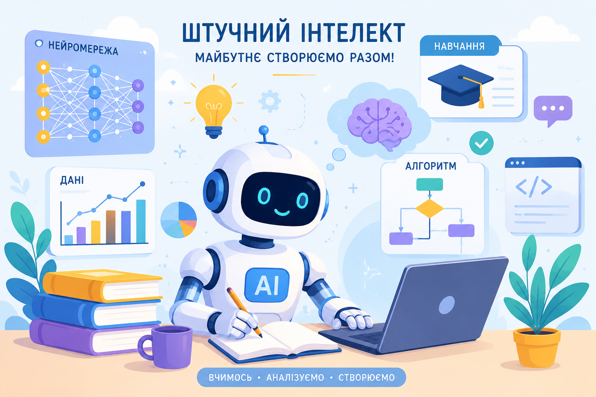

<link rel="stylesheet" href="styles/custom.css">

# 🤖 Штучний інтелект та машинне навчання

## 👋 Вітаємо на курсі!

Ласкаво просимо до курсу **«Штучний інтелект та машинне навчання»** для учнів 11 класу!  
У цьому курсі ви дізнаєтесь, як працюють сучасні AI-технології, нейромережі, алгоритми машинного навчання та системи, які вже сьогодні змінюють світ 🌍

---

## 🎯 Мета курсу

Метою курсу є:

- ознайомлення з основами штучного інтелекту;
- формування базових навичок роботи з AI-інструментами;
- розвиток алгоритмічного та критичного мислення;
- вивчення принципів машинного навчання та аналізу даних;
- підготовка до сучасних цифрових професій 💻

---

## 👥 Цільова аудиторія

Курс призначений для:

- учнів **11 класу**;
- початківців у сфері програмування та AI;
- тих, хто цікавиться сучасними технологіями;
- майбутніх IT-фахівців та дослідників 🔬

---

## 🚀 Очікувані результати навчання

Після проходження курсу ви зможете:

✅ пояснювати основні поняття AI та ML  
✅ розрізняти типи машинного навчання  
✅ працювати з простими AI-сервісами  
✅ аналізувати дані та робити висновки  
✅ створювати базові моделі машинного навчання  
✅ розуміти етичні аспекти використання AI

---

# 📚 Навігація по курсу

### 📖 Теоретичний блок:
- 📄 [Основи машинного навчання](theory/main-content.md)
- 🌍 [Приклади використання ШІ](theory/examples.md)
- 🧠 [Словник термінів](theory/glossary.md)

### 💻 Практичний блок:
- ✍️ [Практичні завдання (Промпти)](practice/tasks.md)
- 🧪 [Лабораторна робота (Власна нейромережа)](practice/labs.md)

### 📝 Перевірка знань:
- 🎮 [Інтерактивний тест (JS)](tests/self-check.md)
- 🎓 [Підсумкове оцінювання (Есе)](tests/assessment.md)

### 🌐 Додатково:
- 🔗 [Корисні ресурси та відео](resources/links.md)

---

## 🌟 Побажання успіху

Бажаємо цікавого навчання, нових відкриттів та натхнення у світі штучного інтелекту! 🚀🤖
